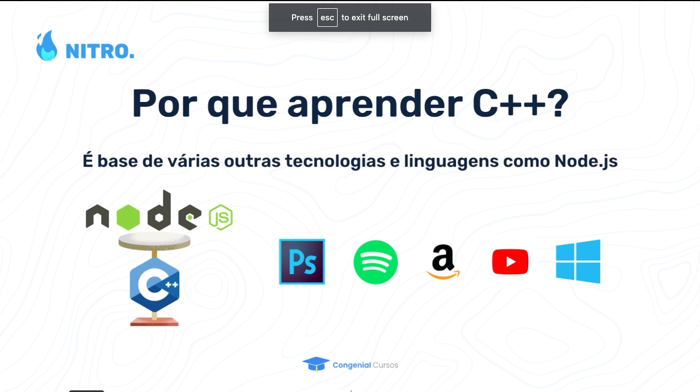
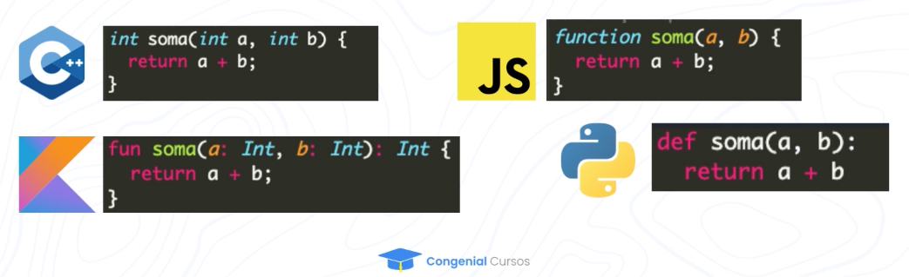
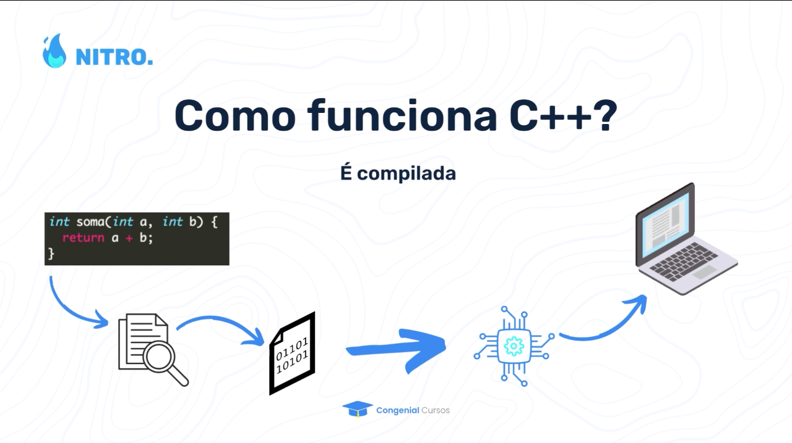
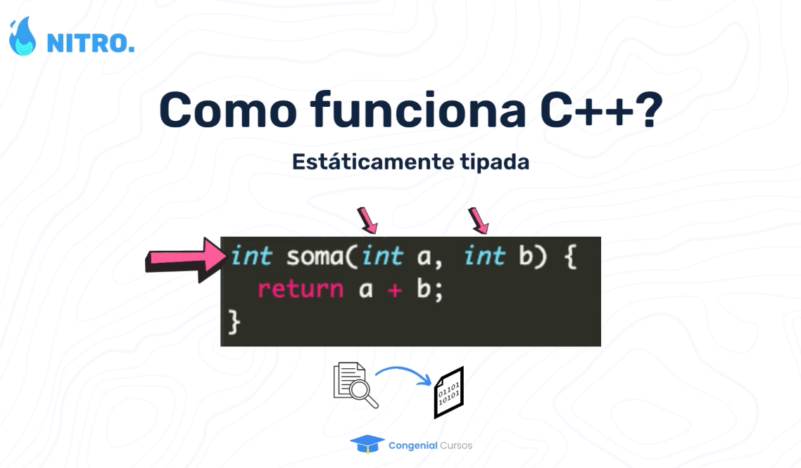
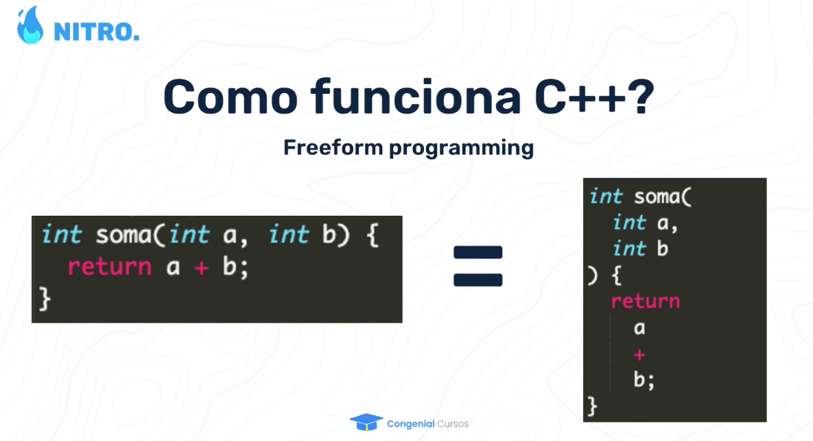

# NITRO
Algorithms and Data Structure Course with C++

# Porque Aprender C++?

## Linguagem de Proposito Geral

HTML = Linguagem de Marcacao de Texto, feita somente para o navegador renderizar.

Javascript = Criada com finalidade de criar interacoes do Usuario com o browser, apesar de hoje ter diversas finalidades, isso faz com que a Linguagem tenha alguns problemas. 

MySQL = Linguagem feita com a finalidade de consulta. 

## Entender a verdade

Algumas bibliotecas de Python fazem muitas coisas para voce, sendo que no inicio é essencial aprender e entender o Algoritimo. 

## Mais simples de Tratar I/O

Mais facil de tratar e a estruturacao do codigo fica melhor, alem do tratamendo das variaveis ficando mais dinamico, ao contrario do JS que nao foi feita para coletar entrada de comandos no terminal, e sim para coletar no Navegador, para isso é necessario executar um arquivo com todos os comandos que o usuario fez. 

```cpp
cin >> entrada; 
cout << "Saida" << endl;
```

## Base de outras Tecnologias



C++ foi a base para o NODE.JS, porque com o C++ faz com que seja possivel a execucao de Node.JS no lado do Servidor em vez de somente no Navegador. 

## Sintaxe Moderna

Tem a Sintaxe moderna e semelhante a varias outras linguages de alto nivel, so que é mais rápida que a maioria. 



# Como Funciona C++

## É compilada

Após o codigo ser escrito, por sua vez ele vai precisar de um compilador para analisar se nao possui nenhum erro no codigo, feita a verificacao, vai ser gerado um arquivo binario que vai ser processado pelo processador e executado pelo computador.  



## Estaticamente Tipada

Isso significa que devemos sempre identificar o tipo de variaveis que estamos tratando em uma funcao. 



## Freeform Programing

Isso significa que se escrevermos sem uma devida organizacao mas seguindo a regra da sintaxe, ele vai ser executado, Ao contrario de Python que se nao seguir a identacao o codigo nem executa.


